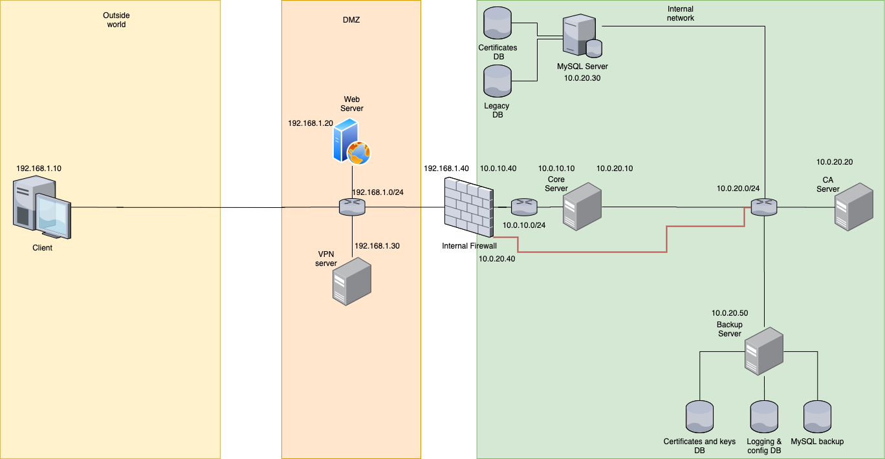

# Applied Security Laboratory 2020

## Setup
You can download the images of the VM with the link received by email. Before running for the first time the VM, please setup the `shared folder` as the screenshot below. The path `/media/asl` must point to the root of this repo.

The networks are configured according to this network plan (ip addresses are defined in the `setup.sh`). 

For development reason, all VM have also a NAT interface with Internet. We will remove it before the hand in (except maybe for the client). All VM have already OpenSSH installed.

## Description
All installations, settings **must** be done inside the `setup.sh` corresponding to your VM (for example if you want to copy a file inside the folder `/var/apache` write inside `setup.sh` `cp /media/asl/vm_folder/your_config.conf /var/apache`). If you make it manually, we will not have all the same versions of our environement. This script is launch at each boot of the VM (launch by the service `setup.service` in `/etc/systemd/system/setup.service`) or can be launch with the command `sudo systemctl start setup.service`. I recommand to make a snapshot of the state after the first setup (see on the [Virtualbox documentation](https://www.virtualbox.org/manual/ch01.html#snapshots)) to test if everything works from a fresh VM before you push on the master branch your new feature. 

## Credentials
On all VM, the username/password is by default `ubuntu` `ubuntu`. For security reason, write a command to change it inside the `setup.sh` corresponding to the VM.

|  User         | Machine       | Password          |
|---            |---            |---                |
|  backup_user  | CA            |WR=JdhtW4R_qV4b9   |
|  backup_user  | Core          |7zM2YCHky=SQ?e3n   |
|  backup_user  | Firewall      |rS^9cN?E?jxTj@4K   |
|  backup_user  | MySQLDatabase |4-c/hT?CsHTg$b&<Xt  |
|  backup_user  | VPN           |?c_bEpuN-ssCJ4Y3   |
|  backup_user  | WebServer     |C?NMuPu77c4sHfa3   |
